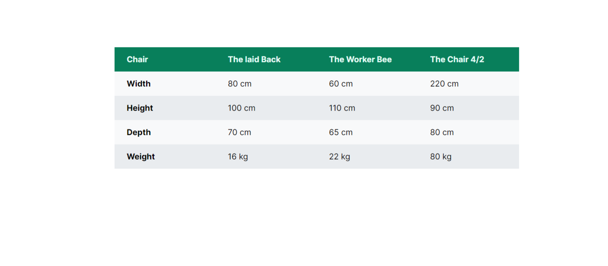

# Table Component

This is a simple table component styled by only CSS. Made by table tag in HTML.

## Table of contents

- [Overview](#overview)

  - [Screenshot](#screenshot)
  - [Links](#links)

- [Author](#author)

## Overview

### Screenshot

### Links

- Live Site URL: [Live-Demo](https://ali-css-components.netlify.app/table-component/)

## Author

- Website - [Ali Mashayekhi]()
- Twitter - [@alimashayekhi42](https://www.twitter.com/alimashayekhi42)
